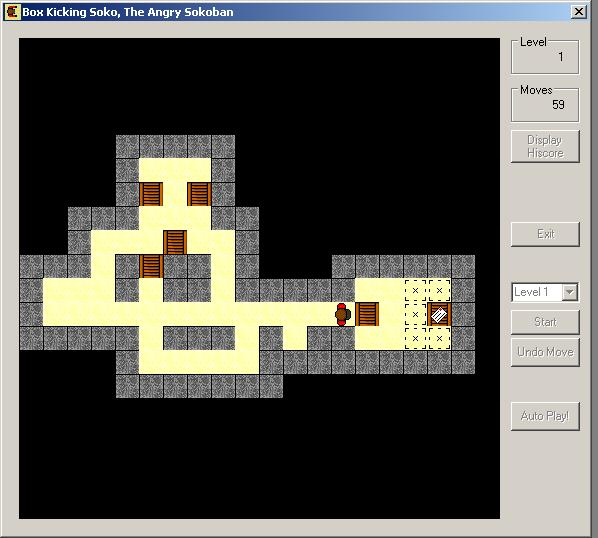

<div align="center">

## Sokoban


</div>

### Description

Sokoban is a game where you have to push boxes to a target area.

First 12 levels are "AutoPlayable" & level 17, more levels will be "AutoPlayable" as You finish them. (Choose level, press [start], press [AutoPlay])

Original JAVA game can be found at: http://www.pimpernel.com/sokoban/sokoban.html

Can You break My score??

Programming: Bobbek

Graphics and Layout: Duncan
 
### More Info
 
Keyboard, Mouse

Nothing really, assumes You know how to push a box in front of you...

Hours and hours of fun :-)

Minor,

Tried arms

Squared eyes

Wasted time ;-)


<span>             |<span>
---                |---
**Submitted On**   |2003-11-19 15:50:38
**By**             |[Bobbek](https://github.com/Planet-Source-Code/PSCIndex/blob/master/ByAuthor/bobbek.md)
**Level**          |Beginner
**User Rating**    |5.0 (45 globes from 9 users)
**Compatibility**  |VB 6\.0
**Category**       |[Games](https://github.com/Planet-Source-Code/PSCIndex/blob/master/ByCategory/games__1-38.md)
**World**          |[Visual Basic](https://github.com/Planet-Source-Code/PSCIndex/blob/master/ByWorld/visual-basic.md)
**Archive File**   |[Sokoban16748911222003\.zip](https://github.com/Planet-Source-Code/bobbek-sokoban__1-50000/archive/master.zip)

### API Declarations

```
Some, for getting:
KeyPress
ActiveWindow
INI
```


